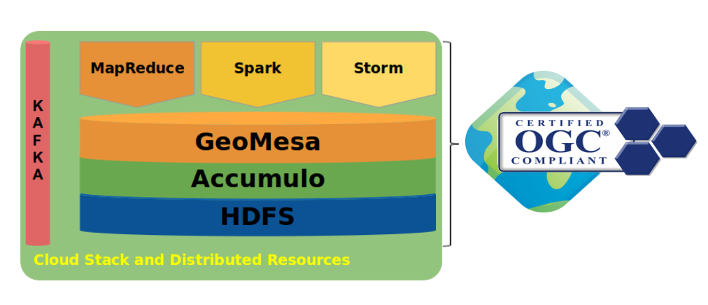

# GeoMesa**-空间数据存储引擎


## **第一部分：GeoMesa**简介

- GeoMesa是一款开源的基于分布式计算系统的⾯面向海海量量时空数据查询与分析的⼯工具包

- GeoMesa基于GeoToolsAPI进⾏行行设计，与GeoServer等进⾏行行集成提供OGC标准的服务。

- 

- ⽀支持多种可扩展的、基于云端的数据存储架构，包括ApacheAccumulo,HBase，Cassandra，Google Bigtable，以及⽤用于流计算的Apache Kafka 。

- 

- 提供了了Spark，并增加了了正对空间数据的UDT、UDF和UDAF，⽅方便便⽤用户直接使⽤用SparkSQL进⾏行行空间数据查询与分析。

- Git 地址：https://github.com/locationtech/geomesa。

- Build地址：https://github.com/locationtech/geomesa/releases

- 

  

## **第二部分：GeoMesa**架构体系

### 1：模块划分

 

- - [6.1. GeoTools Feature Types](https://www.geomesa.org/documentation/user/datastores/attributes.html)
  - [6.2. Index Overview](https://www.geomesa.org/documentation/user/datastores/index_overview.html)
  - [6.3. Index Basics](https://www.geomesa.org/documentation/user/datastores/index_basics.html)
  - [6.4. Index Versioning](https://www.geomesa.org/documentation/user/datastores/index_basics.html#index-versioning)
  - [6.5. Index Configuration](https://www.geomesa.org/documentation/user/datastores/index_config.html)
  - [6.6. Runtime Configuration](https://www.geomesa.org/documentation/user/datastores/runtime_config.html)
  - [6.7. Query Planning](https://www.geomesa.org/documentation/user/datastores/query_planning.html)
  - [6.8. Explaining Query Plans](https://www.geomesa.org/documentation/user/datastores/query_planning.html#explaining-query-plans)
  - [6.9. Query Properties](https://www.geomesa.org/documentation/user/datastores/query_config.html)
  - [6.10. Filter Functions](https://www.geomesa.org/documentation/user/datastores/filter_functions.html)
  - [6.11. Analytic Querying](https://www.geomesa.org/documentation/user/datastores/analytic_queries.html)
  - [6.12. Authorizations](https://www.geomesa.org/documentation/user/datastores/authorizations.html)
  - [6.13. Query Auditing](https://www.geomesa.org/documentation/user/datastores/auditing.html)
  - [6.14. Moving and Migrating Data](https://www.geomesa.org/documentation/user/datastores/data.html)
  - [6.15. Reserved Words](https://www.geomesa.org/documentation/user/datastores/reserved_words.html)

- #### 命令行

  <u>[Command-Line Tools](https://www.geomesa.org/documentation/user/cli/index.html)</u>

- #### 底层存储

  - [HBase Data Store](https://www.geomesa.org/documentation/user/hbase/index.html)
  - [Accumulo Data Store](https://www.geomesa.org/documentation/user/accumulo/index.html)
  - [Bigtable Data Store](https://www.geomesa.org/documentation/user/bigtable/index.html)
  - [Cassandra Data Store](https://www.geomesa.org/documentation/user/cassandra/index.html)
  - [Kafka Data Store](https://www.geomesa.org/documentation/user/kafka/index.html)
  - [Redis Data Store](https://www.geomesa.org/documentation/user/redis/index.html)
  - [FileSystem Data Store](https://www.geomesa.org/documentation/user/filesystem/index.html)
  - [Kudu Data Store](https://www.geomesa.org/documentation/user/kudu/index.html)
  - [Lambda Data Store](https://www.geomesa.org/documentation/user/lambda/index.html)

### 2：时空索引-R树

- 据R树的这种数据结构，当我们需要进行一个高维空间查询时，我们只需要遍历少数几个叶子结点所包含的指针，查看这些指针指向的数据是否满足要求即可。

  

- Oracle Spatial、MySQL Spatial、PostgreSQL(PostGIS) 都是基于R树进行空 间搜索操作，即对空间字段(Geometry Column)创建R树索引。

- R树存在的问题:

  1. 单独创建索引⽂文件 
  2. 数据更更新问题：为了了达到平衡状态，新插⼊入数据需要更更新整个R树 。
  3. 不不适合NoSQL的结构
     HBase本身只提供基于⾏行行键和全表扫描的查询，⽽而⾏行行键索引单⼀一，对于多维度的查询困难。

### 3：GeoHash

#### 1简介

 GeoHash是一种地址编码方法。他能够把二维的空间经纬度数据编码成一个字符串。GeoHash具有以下特点： 
1、GeoHash用一个字符串表示经度和纬度两个坐标。在数据库中可以实现在一列上应用索引 
2、GeoHash表示的并不是一个点，而是一个区域； 
3、GeoHash编码的前缀可以表示更大的区域。例如wx4g0ec1，它的前缀wx4g0e表示包含编码wx4g0ec1在内的更大范围。 这个特性可以用于附近地点搜索 。

####  2：GeoHash的计算过程： 

##### 1.将经纬度转换成二进制： 

比如这样一个点（39.923201, 116.390705） 纬度的范围是（-90，90），其中间值为0。对于纬度39.923201，在区间（0，90）中，因此得到一个1；（0，90）区间的中间值为45度，纬度39.923201小于45，因此得到一个0，依次计算下去，即可得到纬度的二进制表示。


 最后得到纬度的二进制表示为： 10111000110001111001 
同理可以得到经度116.390705的二进制表示为： 11010010110001000100 

#####  2.合并纬度、经度的二进制： 

合并方法是将经度、纬度二进制按照奇偶位合并： 1110011101001000111100000011010101100001 

如下图：


#####  3：按照Base32进行编码： 

Base32编码表（其中一种）：


 将上述合并后二进制编码后结果为： wx4g0ec1

#### 3：特点：

- [x]  字符串越长，表示的范围越小越精确;字符串长度越小，表示的范围越大越宽泛。
- [x] 字符串越相似表示距离越相近。


### 4：GeoMesa时空索引

#### 1：各种空间填充曲线


####  2：空间查询

1.   用户定义查询窗口
2. 层次划分
3. 计算查询范围(Range)


#### 3：GeoMesa时空索引

 GeoMesa使用了基于Z-order填充曲线的GeoHash空间索引技术，
 并针对时间维度进行了扩展，具体分为:
•  Z2:空间，点索引
•  Z3:时间+空间，点索引
•  XZ2:空间，线\面索引
•  XZ3:时间+空间，线\面索引。


git实现：https://github.com/locationtech/sfcurve

​            https://github.com/locationtech/geomesa/tree/master/geomesa-z3

###   5：GeoMesa HBase 索引

1.  RowKey设计

   

-  属性索引 
-  Z-Index Shards: 预拆分，范围为1-127，默认为4。 
- Z-Index Time Interval 

2. 查询：

   - 可以按照属性查询
   - 可以按照空间范围查询
   - 可以按照时间查询
   - Geomesa会综合选择一种最快的查询方式执行

   


## 第三部分：GeoMesa 数据存储

### 1：数据结构

**SimpleFeatureType**：空间数据结构描述，包含空间WKT、时间信息、属性信息等。

```java
import org.locationtech.geomesa.utils.interop.SimpleFeatureTypes;
SimpleFeatureTypes.createType("example", "name:String,dtg:Date,*geom:Point:srid=4326");
```

**属性类型**

| Attribute Type     | Binding                                      | Indexable |
| ------------------ | -------------------------------------------- | --------- |
| String             | java.lang.String                             | Yes       |
| Integer            | java.lang.Integer                            | Yes       |
| Double             | java.lang.Double                             | Yes       |
| Long               | java.lang.Long                               | Yes       |
| Float              | java.lang.Float                              | Yes       |
| Boolean            | java.lang.Boolean                            | Yes       |
| UUID               | java.util.UUID                               | Yes       |
| Date               | java.util.Date                               | Yes       |
| Timestamp          | java.sql.Timestamp                           | Yes       |
| Point              | org.locationtech.jts.geom.Point              | Yes       |
| LineString         | org.locationtech.jts.geom.LineString         | Yes       |
| Polygon            | org.locationtech.jts.geom.Polygon            | Yes       |
| MultiPoint         | org.locationtech.jts.geom.MultiPoint         | Yes       |
| MultiLineString    | org.locationtech.jts.geom.MultiLineString    | Yes       |
| MultiPolygon       | org.locationtech.jts.geom.MultiPolygon       | Yes       |
| GeometryCollection | org.locationtech.jts.geom.GeometryCollection | Yes       |
| Geometry           | org.locationtech.jts.geom.Geometry           | Yes       |
| List[A]            | java.util.List<A>                            | Yes       |
| Map[A,B]           | java.util.Map<A, B>                          | No        |
| Bytes              | byte[]                                       | No        |


## 第四部分：GeoMesa Hbase应用

### 1：Geomesa Hbase操作


### 2：GeoServer集合 Geomesa

Geomesa实现了GeoTools接口，提供了基于HTTP，方法和标准OGC服务的访问形式。

- [Web Feature Service (WFS)](http://www.opengeospatial.org/standards/wfs)

- [Web Mapping Service (WMS)](http://www.opengeospatial.org/standards/wms)

- [Web Processing Service (WPS)](http://www.opengeospatial.org/standards/wps)

- [Web Coverage Service (WCS)](http://www.opengeospatial.org/standards/wcs)

  ##### 数据更新流程

  

##### 数据查询流程


## 第五部分：Geomesa Spark


###  1：geomesa-spark-jts ：基于Spark 的JTS控件库。

**依赖包**：

```java
<dependency>
  <groupId>org.locationtech.geomesa</groupId>
  <artifactId>geomesa-spark-jts_2.11</artifactId>
</dependency>
```

**从文件系统读取**


```scala
import org.locationtech.jts.geom._
import org.apache.spark.sql.types._
import org.locationtech.geomesa.spark.jts._

import spark.implicits._

val schema = StructType(Array(
  StructField("name",StringType, nullable=false),
  StructField("pointText", StringType, nullable=false),
  StructField("polygonText", StringType, nullable=false),
  StructField("latitude", DoubleType, nullable=false),
  StructField("longitude", DoubleType, nullable=false)))

val dataFile = this.getClass.getClassLoader.getResource("jts-example.csv").getPath
val df = spark.read
  .schema(schema)
  .option("sep", "-")
  .option("timestampFormat", "yyyy/MM/dd HH:mm:ss ZZ")
  .csv(dataFile)

val alteredDF = df
  .withColumn("polygon", st_polygonFromText($"polygonText"))
  .withColumn("point", st_makePoint($"latitude", $"longitude"))
```

**构造df**

```scala
import spark.implicits._
val point = new GeometryFactory().createPoint(new Coordinate(3.4, 5.6))
val df = Seq(point).toDF("point")
```


### 2：geomesa-spark-core：基于Geotools实现的Spark核心库，将空间数据转换为RDD。

```scala
// DataStore params to a hypothetical GeoMesa Accumulo table
val dsParams = Map(
  "accumulo.instance.id"   -> "instance",
  "accumulo.zookeepers"    -> "zoo1,zoo2,zoo3",
  "accumulo.user"          -> "user",
  "accumulo.password"      -> "*****",
  "accumulo.catalog"       -> "geomesa_catalog",
  "geomesa.security.auths" -> "USER,ADMIN")

// set SparkContext
val conf = new SparkConf().setMaster("local[*]").setAppName("testSpark")
val sc = SparkContext.getOrCreate(conf)

// create RDD with a geospatial query using GeoMesa functions
val spatialRDDProvider = GeoMesaSpark(dsParams)
val filter = ECQL.toFilter("CONTAINS(POLYGON((0 0, 0 90, 90 90, 90 0, 0 0)), geom)")
val query = new Query("chicago", filter)
val resultRDD = spatialRDDProvider.rdd(new Configuration, sc, dsParams, query)

resultRDD.collect
// Array[org.opengis.feature.simple.SimpleFeature] = Array(
//    ScalaSimpleFeature:4, ScalaSimpleFeature:5, ScalaSimpleFeature:6,
//    ScalaSimpleFeature:7, ScalaSimpleFeature:9)
```

包括SimpleFeatures、 Multiple backends （Accumulo, HBase, FileSystem, Kudu, [GeoMesa Convert](https://www.geomesa.org/documentation/user/convert/index.html#converters) library转换后文件系统, 其他 GeoTools 数据源）

### 3：geomesa-spark-sql：基于SparkSQl 的空间查询库

```scala
// DataStore params to a hypothetical GeoMesa Accumulo table
val dsParams = Map(
  "accumulo.instance.id"   -> "instance",
  "accumulo.zookeepers"    -> "zoo1,zoo2,zoo3",
  "accumulo.user"          -> "user",
  "accumulo.password"      -> "*****",
  "accumulo.catalog"       -> "geomesa_catalog",
  "geomesa.security.auths" -> "USER,ADMIN")

// Create SparkSession
val sparkSession = SparkSession.builder()
  .appName("testSpark")
  .config("spark.sql.crossJoin.enabled", "true")
  .master("local[*]")
  .getOrCreate()

// Create DataFrame using the "geomesa" format
val dataFrame = sparkSession.read
  .format("geomesa")
  .options(dsParams)
  .option("geomesa.feature", "chicago")
  .load()
dataFrame.createOrReplaceTempView("chicago")

// Query against the "chicago" schema
val sqlQuery = "select * from chicago where st_contains(st_makeBBOX(0.0, 0.0, 90.0, 90.0), geom)"
val resultDataFrame = sparkSession.sql(sqlQuery)

resultDataFrame.show
/*
+-------+------+-----------+--------------------+-----------------+
|__fid__|arrest|case_number|                 dtg|             geom|
+-------+------+-----------+--------------------+-----------------+
|      4|  true|          4|2016-01-04 00:00:...|POINT (76.5 38.5)|
|      5|  true|          5|2016-01-05 00:00:...|    POINT (77 38)|
|      6|  true|          6|2016-01-06 00:00:...|    POINT (78 39)|
|      7|  true|          7|2016-01-07 00:00:...|    POINT (20 20)|
|      9|  true|          9|2016-01-09 00:00:...|    POINT (50 50)|
+-------+------+-----------+--------------------+-----------------+
*/
```


## 第六部分：Cassandra应用

1：Cassandra config

spring.data.cassandra.cluster-name=Test Cluster
spring.data.cassandra.keyspace-name= user_space
spring.data.cassandra.contact-points=127.0.0.1
spring.data.cassandra.port=9042

2：run test

java -cp geomesa-tutorials-cassandra/geomesa-tutorials-cassandra-quickstart/target/geomesa-tutorials-cassandra-quickstart-2.4.0-SNAPSHOT.jar org.geomesa.example.cassandra.CassandraQuickStart --cassandra.contact.point 127.0.0.1:9042 --cassandra.keyspace geomesa --cassandra.catalog sample_table 

3：output        

bin/geomesa-cassandra export --output-format leaflet --contact-point 127.0.0.1:9042 --key-space geomesa --catalog sample_table

